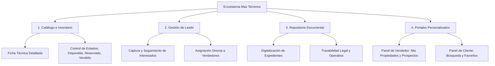

# MAZ TERRENOS
### Plataforma Integral de Comercialización y Gestión Inmobiliaria Sostenible

---

## 1. Presentación del Proyecto

**Maz Terrenos** es un ecosistema digital de nivel empresarial diseñado específicamente para la administración, promoción y comercialización formal de desarrollos de terrenos. La plataforma actúa como un puente tecnológico robusto que conecta el inventario físico de tierras con las operaciones de ventas, el control documental y la trazabilidad de prospectos (leads) en tiempo real.

A diferencia de los portales inmobiliarios genéricos, **Maz Terrenos** ha sido concebido desde sus cimientos como una herramienta especializada que responde a la complejidad técnica y legal intrínseca del mercado de terrenos, tales como las especificaciones de superficie, zonificación, pendientes y expediente legal de cada propiedad.

---

## 2. Finalidad y Propósito

El desarrollo de esta plataforma responde a tres objetivos estratégicos fundamentales en el sector inmobiliario moderno:

### A. Centralización y Eficiencia Operativa
Erradicar la dispersión de información y el uso de registros manuales o plantillas de cálculo tradicionales. La plataforma consolida en una base de datos única y relacional todo el catálogo de terrenos, expedientes documentales y el historial de interacciones con los clientes.

### B. Transparencia y Trazabilidad Comercial
Establecer un flujo comercial transparente en el que cada acción (publicación, registro de interesado, carga de documentos) esté vinculada a un usuario formalizado (Vendedor, Cliente o Administrador). Esto garantiza un control total sobre el estado de cada lote (Disponible, Reservado, Vendido) y evita conflictos como la duplicidad de ofertas.

### C. Digitalización e Integridad Documental
Facilitar la formalización de las operaciones mediante la integración de un repositorio digitalizado para cada propiedad. Esto reduce los tiempos muertos en los procesos de compraventa al permitir que tanto el vendedor como el cliente tengan acceso inmediato a escrituras, planos y contratos de manera segura.

---

## 3. Pilares Funcionales de la Plataforma

El ecosistema de **Maz Terrenos** se estructura sobre cuatro pilares esenciales que garantizan su óptimo funcionamiento:

### 1. Gestión de Catálogo e Inventario de Terrenos
* **Ficha Técnica Detallada:** Registro completo de los atributos físicos de cada predio (medidas de largo y ancho, cálculo de superficie total, tipo de pendiente y nivel de zonificación residencial, comercial, industrial, agrícola o mixta).
* **Galería Multimedia Integrada:** Almacenamiento optimizado de imágenes reales y renders conceptuales del terreno.
* **Control de Disponibilidad en Tiempo Real:** Actualización instantánea del estado comercial de cada terreno para evitar fricciones comerciales.

### 2. Administración y Trazabilidad de Prospectos (Leads)
* **Captura Inteligente:** Registro automático de interesados que solicitan información detallada de una propiedad específica.
* **Asignación y Seguimiento:** Módulo que permite a los asesores comerciales documentar el estatus de sus conversaciones, fechas de contacto y requerimientos específicos del cliente.

### 3. Integridad Documental
* **Manejo de Expedientes Digitales:** Almacenamiento seguro de documentos jurídicos clave asociados a los terrenos, optimizando los tiempos del proceso administrativo pre-cierre y post-venta.

### 4. Portales de Experiencia Centrados en el Usuario (Role-Based Panels)
* **Panel de Clientes:** Interfaz intuitiva para explorar el inventario, aplicar filtros inteligentes de búsqueda (ubicación, rango de precio, dimensiones) y contactar directamente a los asesores.
* **Panel de Vendedores:** Tablero de mando enfocado en la productividad donde el asesor gestiona sus terrenos publicados, visualiza su cartera de prospectos activos y carga los documentos del cierre de operaciones.

---

## 4. Filosofía de Desarrollo y Arquitectura

La plataforma está diseñada bajo un enfoque de **Arquitectura Limpia (MVC)** y construida utilizando las tecnologías más robustas del desarrollo web moderno:

* **Núcleo de Software:** Utilización del framework **Laravel** y **PHP**, garantizando un procesamiento de backend rápido, seguro y escalable, respaldado por un sistema de autenticación nativo y middleware de control de accesos.
* **Base de Datos Relacional:** Motor **MariaDB** estructurado para ofrecer máxima integridad referencial en la trazabilidad de usuarios, inventario, transacciones comerciales e interacciones con clientes.
* **Estándar de Diseño Visual (UX/UI):** Implementación de una interfaz altamente visual, adaptada a dispositivos móviles y de escritorio, utilizando los principios modernos de diseño (fuente corporativa *Work Sans*, colores semánticos con verde bosque `#228b22` y fondos sofisticados en `#f8f8ff`).
